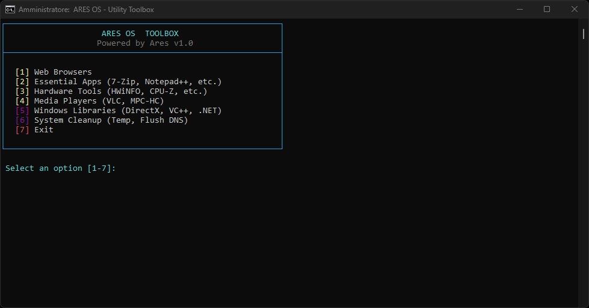

# ARES OS

**Extreme Performance. Zero Bloatware.**

A modified Windows operating system engineered for extreme gamers and power users.
Built exclusively on Microsoft's LTSC IoT branches — stripped down to what matters.

&nbsp;

---

## Project Status

> **Work in Progress — Release TBA**
>
> ARES OS is currently under active development. No downloads are available at this time.
> Follow the [official website](https://ares-os-official.github.io/) and join the [Discord server](https://discord.gg/ZFR22fshEZ) for release announcements.

---

## What is ARES OS?

Ares OS is a modified Windows operating system built for maximum performance and zero bloatware. It runs at just **100–120 active processes at startup**, stripping everything non-essential from the system.

Built exclusively on Microsoft's LTSC IoT branches, Ares OS is designed for extreme gamers and power users who demand the lowest possible latency, minimal RAM overhead, and a clean system foundation.

---

## Editions

ARES OS is offered in two editions, each based exclusively on an LTSC IoT branch.

---

### ARES OS 10 — 21H2 LTSC IoT

- Maximum stability and compatibility
- Ideal for older hardware and eSports scenarios
- Absolute lowest latency (DPC)
- Extended security support through 2032

---

### ARES OS 11 — 24H2 LTSC IoT

- Advanced scheduler for hybrid CPUs
- Modern core with API and DirectX 12 support
- No native bloatware, lighter UI
- Optimized RAM management

---

## Core Features

| Feature | Description |
|---|---|
| **Process Stripping** | Reduced to only 100–120 active processes at startup |
| **Zero Bloatware** | Complete removal of all preinstalled applications |
| **LTSC IoT Base** | Built on server-grade stability, designed to last |
| **Minimized Latency** | System tweaks targeting reduced input lag in games |

---

## Performance

The following figures are presented on the [official ARES OS website](https://ares-os-official.github.io/):

| Metric | ARES OS | ARES OS + Low-End Device | Standard Windows |
|---|---|---|---|
| **RAM at startup** | 1.2 GB | 900 MB | 4.5 GB |
| **System stability** | +50% | N/A | N/A |

> These are performance claims published by the Ares OS project on its official website.

---

## Anti-Cheat Compatibility

ARES OS preserves Microsoft kernel integrity and driver signature requirements.

All major anti-cheat systems are reported to function correctly — including kernel-level solutions such as **Valorant Vanguard** and **Easy Anti-Cheat (EAC)** — without false positives or blocks.

---

## ARES OS Toolbox

Ares OS includes the **Ares Utility Toolbox (v1.0)**, a lightweight post-installation CLI wizard built to quickly set up your environment and perform essential system maintenance without manual searching.

Key features listed in the menu include:
* **Web Browsers:** Quick deployment of your preferred browser.
* **Essential Apps:** Fast installation of daily utilities like 7-Zip, Notepad++, and more.
* **Hardware Tools:** Instant setup for diagnostic utilities such as HWiNFO and CPU-Z.
* **Media Players:** Easy installation of lightweight players like VLC and MPC-HC.
* **Windows Libraries:** Deployment of essential runtime environments (DirectX, Visual C++ Redistributables, and .NET).
* **System Cleanup:** One-click optimization to clear temporary files and flush DNS cache.

  

---

## Downloads

**Downloads are not yet available.**

ARES OS is still in active development. No ISO files have been released.

Stay informed via the [official website](https://ares-os-official.github.io/) and the [Discord community](https://discord.gg/ZFR22fshEZ).

### Early ISO Access

The official ARES OS newsletter will also be used to identify and select users who may receive early access to the ARES OS ISO before its public release.

Newsletter registration does not automatically guarantee early ISO access. Eligible users will be selected by the ARES OS team and contacted using the email address provided during registration.

---

## Community

Join the Discord server for development updates, announcements, and community support.

---

## License

Licensed under the **GNU General Public License v2.0**.

[Read the full GPL-2.0 License](./LICENSE)

---

## Disclaimer

ARES OS is an independent community project. It is not affiliated with, endorsed by, or sponsored by Microsoft Corporation.

Windows, DirectX, and related names are trademarks of Microsoft Corporation. This software is distributed as-is, without warranty of any kind. See the [GPL-2.0 License](./LICENSE) for full terms and conditions.

---

[**Eddyx12**](https://github.com/Eddyx12) — Eddyx12 ARES OS Founder and Developer & [**ildenteproibito**](https://github.com/ildenteproibito) — IL DENTE PROIBITO Tweaker for ARES OS

[Website](https://ares-os-official.github.io/) &nbsp;•&nbsp; [Discord](https://discord.gg/ZFR22fshEZ) &nbsp;•&nbsp; [GitHub](https://github.com/ares-os-official/ares-os-official.github.io)

